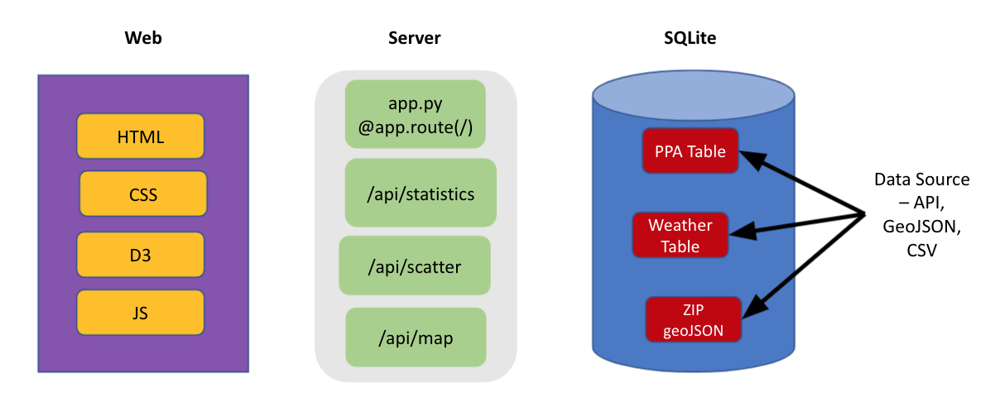
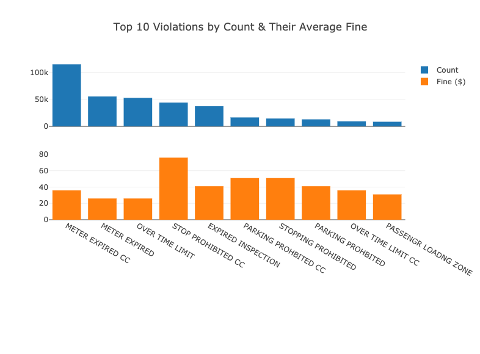
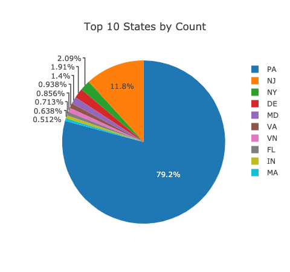

# Philly Parking Violations Analysis :parking: & Indications from Weather :cloud_with_rain: (UPenn Data Boot Camp)

*Last Updated: May 29, 2021*

**Highlevel**: This is an interactive web application that offers analytical insights/patterns into historic parking violations and the potential effects of various weather conditions in Philadelphia. 
**View the deployed app (Heroku) here**: https://philly-parking-violations.herokuapp.com/

## Background

This was the second data analysis project in the Penn Data Boot Camp curriculum. The task was to **tell a story through data visulizations with a focus on providing users an interactive means to explore the data themselves.** As a team, most of us lived in the Philadelphia region. Just like everybody else, we've also had the unpleasant experiences of being ticketed. These experiences were certainly not fun! While we support a system to regulate urban parking because as it is a necessity, they can surely ruin your day and hurt your wallet.

However, instead of being torn by the fact that we received a ticket, what we can do is to be more mindful about how we park, where we park, and when we park. We were very interested in how these tickets were issued by the PPA (Philadelphia Parking Authority) and wanted to provider deeper insights so hopefully our audience can make a more educated decision on how to park their cars. As a result, we set out to learn more about parking violations. Questions we had in mind: What is the most common type of parking violation? Where are they more likely to occur? How often are they issued? And in addition, could weather conditions affect ticket issuance behaviors?

### Data Source:
To answer the above questions, we:
* Retrieved the historic Philadelphia parking violations data from 2017 ([OpenDataPhilly](https://www.opendataphilly.org/dataset/parking-violations));
* Purchased the historical weather data in bulk from that same year ([OpenWeather API](https://openweathermap.org/history-bulk));
* Performed an API call to retrieve the GeoJSON (Polygon) that provides Philadelphia zip codes information ([OpenDataPhilly](https://www.opendataphilly.org/dataset/zip-codes))

## Methods & Approach

**Technical Diagram & Workflow**

* Our application is a flask app.
* ETL (Extract, Transform, Load) processes were performed on the datasets we collected from the various sources listed above.
* Data was loaded into a SQLite database for local testing purposes but later migrated to Heroku Postgres upon deployment.
* To perform various weather related analyses, tables were joined based on a speacial "datetime" column (in string format) which detailed aggregations down to every hour in the days throughout 2017.
* The visualizations were built using libraries including Plotly.js, Leaflet.js, and D3.js, etc.
* The application was deployed on Heroku.

## Highlights & Analyses

Below are some highlights of our application. You can also view our presentation deck [here](https://docs.google.com/presentation/d/12zvvblExMmNb_WNNd9zoDT4At5H9TNzZK52N2xGuJ9o/edit?usp=sharing).

* "Meter Expired CC" (CC means Center City) was not the most expensive offense but was the most commonly issued ticket.

